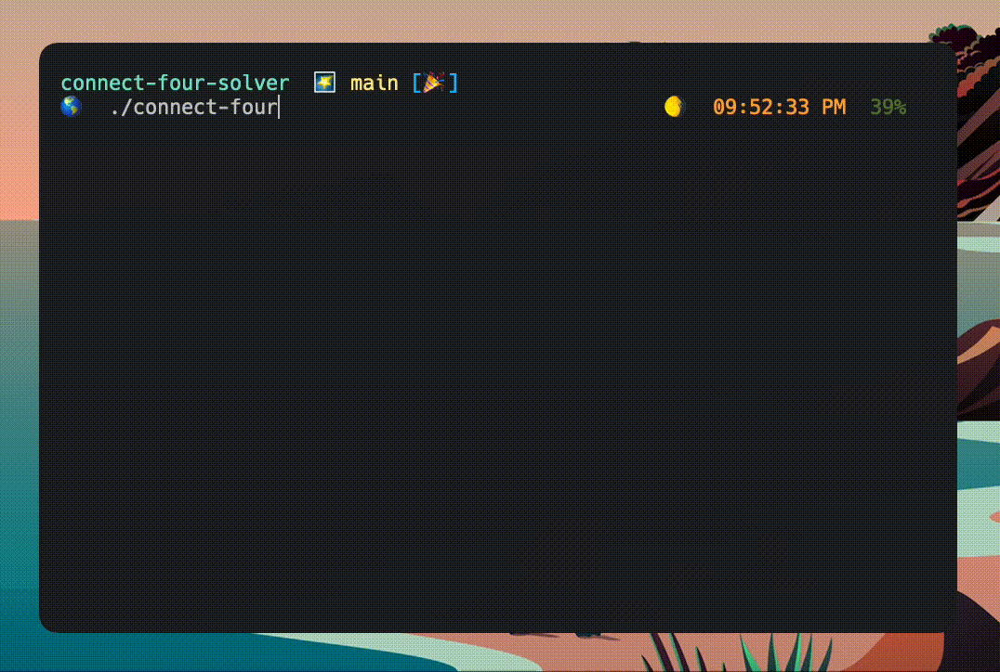

<h1 align="center"> Connect Four Solver </h1> 

 An intelligent connect four advisary. 

 Play against an AI using several modes of difficulty, with the addition of optional trash talking! 

<h2 align="center"> Methods </h2>
The algorithm utilizes Monte Carlo Tree Search (MCTS) to simulate possible game scenarios, and play a move which is most likely to lead to a win condition.

